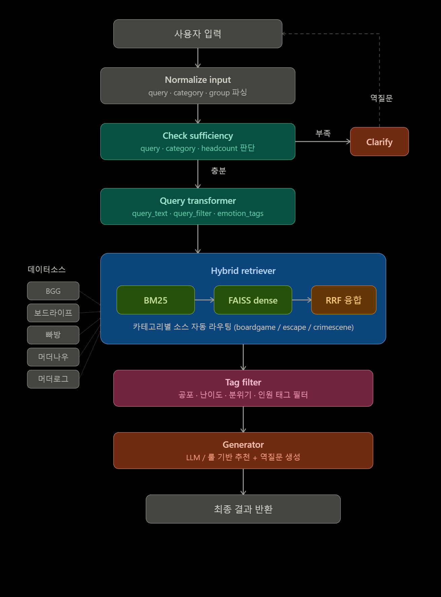
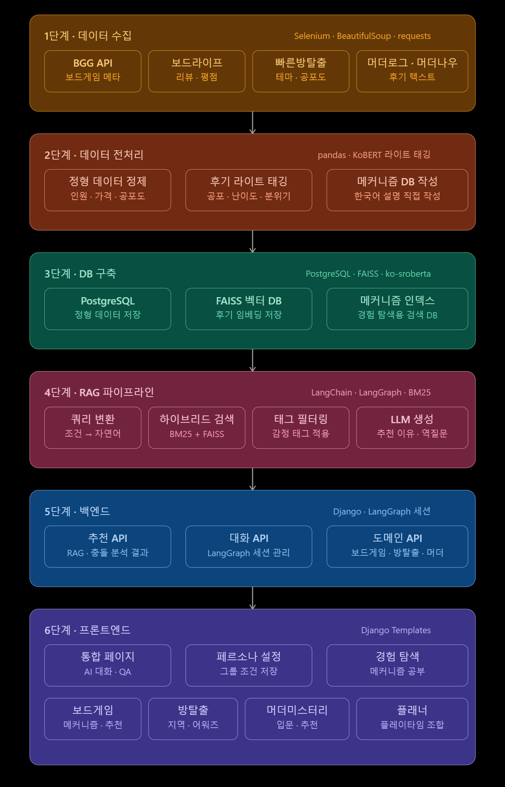
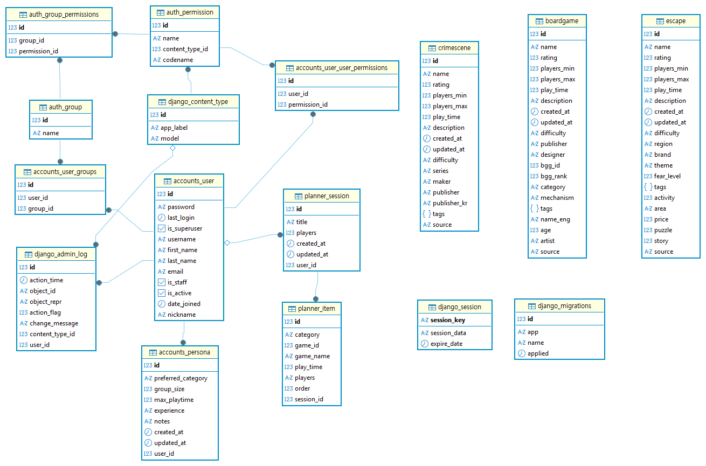

# 🎲 Nolit

**그룹 조건 기반 오프라인 게임 추천 시스템**

> AI 역질문으로 그룹 조건을 수집하고, 실제 후기 데이터를 근거로 실패 없는 선택까지 수렴시키는 RAG 기반 그룹 의사결정 서비스

보드게임 · 방탈출 · 머더미스터리 — 6개 소스에서 수집한 데이터를 통합하고, LangGraph 4단계 파이프라인으로 **"우리 그룹에 맞는 선택"** 을 추천합니다.

<!-- 스크린샷 또는 데모 GIF 추가 예정 -->

---

## ✨ Key Features

| | 기능 | 설명 |
|---|---|---|
| 🗣️ | **Clarifying Question 인터랙션** | 사용자가 조건을 미리 입력하지 않아도 AI가 역질문으로 인원 · 관계 · 공포 수용도 · 예산을 끌어냄 (LangGraph HITL) |
| 🔍 | **BM25 + FAISS 하이브리드 검색** | BM25 + Dense(FAISS) 기반 RRF 하이브리드 검색, 카테고리별 소스 자동 라우팅 |
| 🏷️ | **감정 태그 필터링** | 후기 텍스트에서 공포 · 난이도 · 분위기 · 인원 4차원 라이트 태깅 후 메타데이터 기반 필터 적용 |
| ⚖️ | **메타데이터 가중치 재정렬** | 하드 필터(인원 · 시간 · 지역) + 소프트 가중치(평점 · 복잡도 · 공포도)로 검색 결과 정밀 보정 |
| 🛡️ | **실패 방지 중심 추천** | "이게 좋습니다"가 아닌 "이 선택이면 이렇게 될 수 있습니다"를 근거와 함께 제시 |

---

## 🛠️ Tech Stack

| 영역 | 기술 |
|---|---|
| Language & Framework |   |
| LLM & RAG |     |
| Search & Storage |   |
| Data Collection |   |

---

## 🚀 Getting Started

### 1. 환경 설정

```bash
git clone https://github.com/SKN26-FLOW/Nolit
cd Nolit
pip install -r requirements.txt
```

### 2. 환경변수 설정

```bash
cp .env.example .env
```

`.env` 파일에 아래 키를 입력합니다:

```
OPENAI_API_KEY=...
SUPABASE_URL=...
SUPABASE_KEY=...
```

### 3. 서버 실행

```bash
python manage.py migrate
python manage.py runserver
```

> **Windows:** `./run_all.bat` 또는 `./run_all.ps1`로 실행할 수 있습니다.

---

## 🖥️ 서비스 구조

| 기능 | 설명 |
|---|---|
| **통합 추천** | 자연어 질문 → AI 역질문 → 조건 수렴 → RAG 추천 (1순위 / 안전 대안 / 리스크 표시) |
| **페르소나 설정** | 공포 수용도 · 활동성 · 관계 · 예산을 미리 저장하여 역질문 단계 단축 |
| **경험 탐색** | 장르별 입문 가이드 (예: "크라임씬이 방탈출이랑 뭐가 다른지") |
| **콘텐츠별 탐색** | 보드게임(메커니즘) · 방탈출(지역 · 공포도) · 머더미스터리(유형 + 그룹 조건) |

---

## 🏗️ 시스템 아키텍처

<p align="center">
  
</p>

---

## 🔧 개발 파이프라인

<p align="center">
  
</p>

---

## 🗄️ ERD

<p align="center">
  
</p>

---

## 🔬 Technical Deep Dive

<details>
<summary><b>⚙️ RAG 파이프라인 상세</b></summary>

<br>

### 4단계 파이프라인

| 단계 | 모듈 | 역할 |
|:---:|---|---|
| 1 | **Query Transformer** | 그룹 조건 + 자연어 → 검색 쿼리 변환, 정보 충분 여부 판단 |
| 2 | **Hybrid Retriever** | BM25 + FAISS 기반 RRF 하이브리드 검색, 카테고리별 소스 라우팅 |
| 3 | **Tag Filter** | 공포도 · 난이도 · 분위기 · 관계 감정 태그 필터링 |
| 4 | **Generator** | OpenAI API 또는 룰 기반 추천 · 역질문 생성 |

### 검색 설정

| 항목 | 값 |
|---|---|
| top_k | 5 |
| RRF k | 60 |
| OpenAI 임베딩 | `text-embedding-3-small` (1536d) |
| HuggingFace 임베딩 | `jhgan/ko-sroberta-multitask` (768d) |

### 입출력 예시

```python
from recommender.graph import graph

result = graph.invoke({
    "query": "4명이서 할 전략 보드게임",
    "category": "boardgame",
    "group": {
        "headcount": 4,
        "play_time": 120,
        "weight_pref": "heavy",
        "relation": "friend"
    }
})
```

```json
{
    "answer": "추천 요약 텍스트",
    "games": [
        {
            "title": "브라스: 버밍엄",
            "reason": "...",
            "final_score": 115.57
        }
    ],
    "next_question": "추가 조건을 묻는 역질문 (조건 부족 시)"
}
```

</details>

<details>
<summary><b>⚖️ 메타데이터 필터링 & 가중치</b></summary>

<br>

### 하드 필터 — 조건 밖 결과 완전 제외

| 카테고리 | 필터 항목 |
|---|---|
| 보드게임 | 인원 범위 (`min/max_players`), 플레이 시간 |
| 방탈출 | 지역 (`area/location`), 인원 (`max_players`), 가격, 플레이 시간 |
| 머더미스터리 | 인원 범위, 플레이 시간, 유형 (`scene_category`) |

### 소프트 가중치 — RRF 점수 보너스

| 카테고리 | 주요 항목 |
|---|---|
| 보드게임 | `category/mechanism` 매칭, `avg_rating`, `weight`, 보드라이프 소스 우선 (×1.5) |
| 방탈출 | `horror`, `difficulty`, `satisfaction`, `puzzle/story/interior/production` |
| 머더미스터리 | `difficulty`, `rating` |

### ⚠️ 평점 스케일 주의

| 소스 | 범위 |
|---|---|
| BGG | 1.0 ~ 10.0 |
| 보드라이프 / 머미나우 / 머더로그 / 빠방 | 0.0 ~ 5.0 |

> 소스 간 평점 직접 비교 불가. `None` 값은 0점이 아닌 **데이터 미존재**를 의미합니다.

</details>

<details>
<summary><b>📊 데이터 소스 & 구조</b></summary>

<br>

### 데이터 소스

| 소스 | 카테고리 | 임베딩 | 담당 |
|---|---|---|---|
| **BGG** (BoardGameGeek) | 보드게임 | OpenAI | 재현, 용욱 |
| **보드라이프** | 보드게임 | OpenAI | 다솔, 지혜 |
| **빠른방탈출** | 방탈출 | HuggingFace | 진서 |
| **머더나우** | 머더미스터리 | OpenAI | 윤하 |
| **머더미스터리로그** | 머더미스터리 | OpenAI | 민하 |

### 데이터 3레이어

| 레이어 | 내용 | 역할 |
|---|---|---|
| **정형** | 인원, 가격, 플레이타임, 공포도, 난이도 | 필터링 뼈대 |
| **비정형** | 후기 텍스트 | RAG 검색 소스 |
| **메타** | 어워즈, 평점, 추천 수, 카테고리 순위 | 신뢰도 보정 |

### 라이트 태깅 (4차원)

| 차원 | 예시 |
|---|---|
| 공포 | "생각보다 무서웠어요", "공포 없어서 좋았어요" |
| 난이도 | "너무 어려워서 막혔어요", "입문자도 쉽게 했어요" |
| 분위기 | "처음엔 어색했는데 금방 친해졌어요" |
| 인원 | "4인으로 갔는데 딱 좋았어요" |

</details>

<details>
<summary><b>📋 데이터 컬럼 상세</b></summary>

<br>

#### 보드게임 (BGG / 보드라이프)

| 컬럼 | 설명 | 예시 |
|---|---|---|
| `rank` | 순위 | 1 |
| `title` | 게임 제목 | 윙스팬 |
| `min_players` / `max_players` | 인원 범위 | 1~5 |
| `recommended_players` / `best_players` | 추천/베스트 인원 | 3~4 |
| `playing_time` | 플레이 시간 (분) | 60 |
| `weight` | 복잡도 (0~5) | 2.4 |
| `category` / `mechanism` | 카테고리 / 메커니즘 | 전략 / 엔진 빌딩 |
| `avg_rating` | 평균 평점 | 8.0 |

#### 방탈출 (빠른방탈출)

| 컬럼 | 설명 | 예시 |
|---|---|---|
| `title` | 테마 제목 | 비밀의 방 |
| `horror` / `difficulty` / `activity` | 공포도 / 난이도 / 활동성 (0~5) | 2.0 / 3.2 / 1.5 |
| `satisfaction` | 만족도 | 4.3 |
| `puzzle` / `story` / `interior` / `production` | 세부 평가 | 4.1 / 3.8 / 4.5 / 4.2 |
| `area` / `location` | 지역 | 서울 / 강남구 |

#### 머더미스터리 (머더나우 / 머더미스터리로그)

| 컬럼 | 설명 | 예시 |
|---|---|---|
| `title` | 작품 제목 | 한강 |
| `rating` | 평점 (0~5) | 4.5 |
| `difficulty` | 난이도 (머미나우: 1~4 이산형) | 3 |
| `min_players` / `max_players` | 인원 | 2~6 |
| `play_time` | 플레이 시간 | 120분 |

</details>

---

## 📁 폴더 구조

```
Nolit/
├── 01_data/                    # 원본 수집 데이터
│   ├── boardgame/
│   ├── crimescene/
│   └── escape/
│
├── 02_notebooks/               # 실험용 노트북 & 스크립트
│   ├── crawler/                #   데이터 크롤링
│   ├── embedding/              #   임베딩 생성
│   ├── frontend/               #   프론트엔드 프로토타입
│   └── preprocessing/          #   데이터 전처리
│
├── 03_tests/                   # 테스트 코드
├── 04_vectorstore/             # FAISS 인덱스
│
├── accounts/                   # Django 앱: 사용자 인증
├── contents/                   # Django 앱: 콘텐츠 관리 · 탐색
├── planner/                    # Django 앱: 페르소나 설정
├── recommender/                # Django 앱: AI 추천 엔진 (핵심)
│   ├── rag/                    #   RAG 파이프라인 모듈
│   └── eval/                   #   평가 스크립트
│
├── assets/                     # ERD 등 문서용 이미지
├── config/                     # Django 프로젝트 설정
├── docs/                       # 기술 문서
├── static/                     # CSS, JS, 이미지
├── templates/                  # Django 템플릿
├── config.yaml                 # RAG 설정
├── manage.py
├── requirements.txt
└── README.md
```

---

## 👥 Team FLOW

**프로젝트 기간:** 2026.05.11 — 2026.05.22

<table>
<tr align="center">
<td></td>
<td></td>
<td></td>
<td></td>
<td></td>
<td></td>
<td></td>
</tr>
<tr align="center">
<td><b>김민하</b></td>
<td><b>김용욱</b></td>
<td><b>배재현</b></td>
<td><b>윤지혜</b></td>
<td><b>전윤하</b></td>
<td><b>정다솔</b></td>
<td><b>홍진서</b></td>
</tr>
<tr align="center">
<td><a href="https://github.com/leedhroxx"></a></td>
<td><a href="https://github.com/yonguk12077-beep"></a></td>
<td><a href="https://github.com/rshyun24"></a></td>
<td><a href="https://github.com/jjhhyy0926"></a></td>
<td><a href="https://github.com/yoonha315"></a></td>
<td><a href="https://github.com/soll07"></a></td>
<td><a href="https://github.com/Hong-Jin-seo"></a></td>
</tr>
<tr align="center">
<td>프론트엔드 구성<br>백엔드 구성</td>
<td>RAG<br>PPT 제작</td>
<td>데이터 전처리 + 임베딩<br>PPT 제작<br>발표 준비</td>
<td>데이터 전처리 + 임베딩<br>프론트엔드 구성</td>
<td>RAG<br>README 작성</td>
<td>DB 구축<br>데이터 전처리 + 임베딩<br>프론트엔드 구성</td>
<td>백엔드 구성<br>PPT 제작</td>
</tr>
</table>

### 💬 팀원 회고

<!-- 회고 내용 추가 예정 -->

---

## 📜 License

본 프로젝트의 라이선스 정보는 [LICENSE](./LICENSE)를 참고해 주세요.