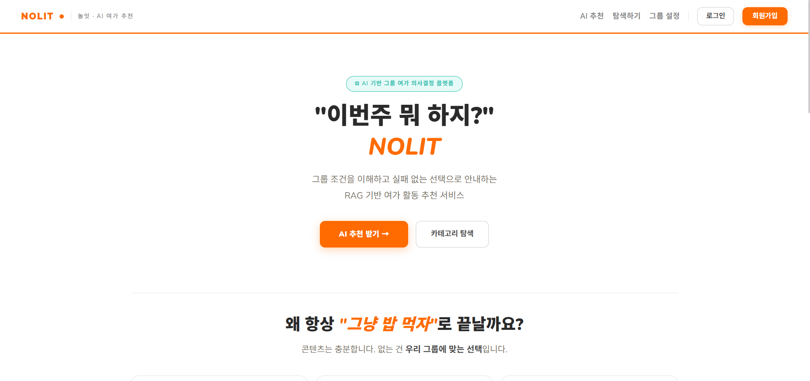
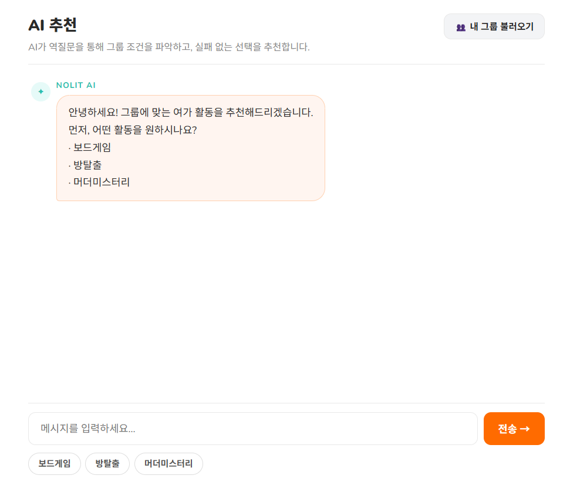
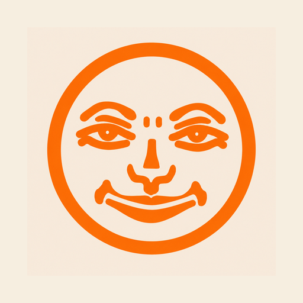
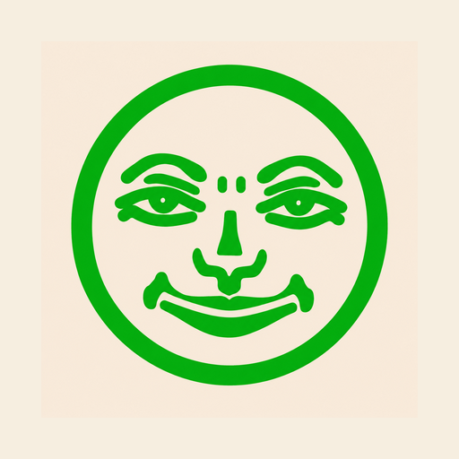
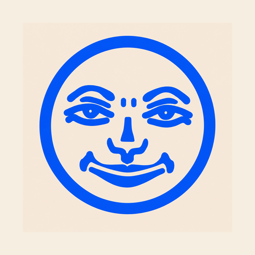
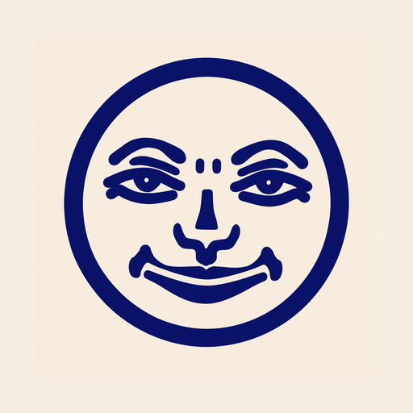
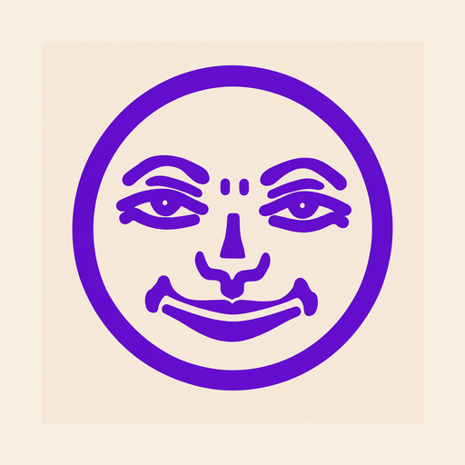

# 🎲 Nolit

**그룹 조건 기반 오프라인 게임 추천 시스템**

> AI 역질문으로 그룹 조건을 수집하고, 실제 후기 데이터를 근거로 실패 없는 선택까지 수렴시키는 RAG 기반 그룹 의사결정 서비스

보드게임 · 방탈출 · 머더미스터리 — 6개 소스에서 수집한 데이터를 통합하고, LangGraph 4단계 파이프라인으로 **"우리 그룹에 맞는 선택"** 을 추천합니다.

<div align="center">
  <table>
    <tr>
      <td align="center" width="50%">
        
      </td>
      <td align="center" width="50%">
        
      </td>
    </tr>
  </table>
</div>

---

## ✨ Key Features

| | 기능 | 설명 |
|---|---|---|
| 🗣️ | **Clarifying Question 인터랙션** | 사용자가 조건을 미리 입력하지 않아도 AI가 역질문으로 인원 · 관계 · 공포 수용도 · 예산을 끌어냄 (LangGraph HITL) |
| 🔍 | **BM25 + FAISS 하이브리드 검색** | BM25 + Dense(FAISS) 기반 RRF 하이브리드 검색, 카테고리별 소스 자동 라우팅 |
| 🏷️ | **감정 태그 필터링** | 후기 텍스트에서 공포 · 난이도 · 분위기 · 인원 4차원 라이트 태깅 후 메타데이터 기반 필터 적용 |
| ⚖️ | **메타데이터 가중치 재정렬** | 하드 필터(인원 · 시간 · 지역) + 소프트 가중치(평점 · 복잡도 · 공포도)로 검색 결과 정밀 보정 |
| 🛡️ | **실패 방지 중심 추천** | "이게 좋습니다"가 아닌 "이 선택이면 이렇게 될 수 있습니다"를 근거와 함께 제시 |

---

## 🛠️ Tech Stack

| 영역 | 기술 |
|---|---|
| Language & Framework |   |
| LLM & RAG |     |
| Search & Storage |   |
| Data Collection |   |
| Frontend Design | [](https://www.figma.com/board/PAr1wnUVCpQUZmT99oeX9h/NOLIT-%ED%99%94%EB%A9%B4-%ED%9D%90%EB%A6%84%EB%8F%84?node-id=0-1&t=UrvyySuCIm5e623w-1) |

---

## 🚀 Getting Started

### 1. 환경 설정

```bash
git clone https://github.com/SKN26-FLOW/Nolit
cd Nolit
pip install -r requirements.txt
```

### 2. 환경변수 설정

```bash
cp .env.example .env
```

`.env` 파일에 아래 키를 입력합니다:

```
OPENAI_API_KEY=...
SUPABASE_URL=...
SUPABASE_KEY=...
```

### 3. 서버 실행

```bash
python manage.py migrate
python manage.py runserver
```

> **Windows:** `./run_all.bat` 또는 `./run_all.ps1`로 실행할 수 있습니다.

---

## 🖥️ 서비스 구조

| 기능 | 설명 |
|---|---|
| **통합 추천** | 자연어 질문 → AI 역질문 → 조건 수렴 → RAG 추천 (1순위 / 안전 대안 / 리스크 표시) |
| **페르소나 설정** | 공포 수용도 · 활동성 · 관계 · 예산을 미리 저장하여 역질문 단계 단축 |
| **경험 탐색** | 장르별 입문 가이드 (예: "크라임씬이 방탈출이랑 뭐가 다른지") |
| **콘텐츠별 탐색** | 보드게임(메커니즘) · 방탈출(지역 · 공포도) · 머더미스터리(유형 + 그룹 조건) |

---

## 🔧 개발 파이프라인

<p align="center">
  
</p>

---

## 🗄️ ERD

<p align="center">
  
</p>

---

## 🔬 Technical Deep Dive

<details>
<summary><b>⚙️ RAG 파이프라인 상세</b></summary>

<br>

<p align="center">
  
</p>

### 4단계 파이프라인

| 단계 | 모듈 | 역할 |
|:---:|---|---|
| 1 | **Query Transformer** | 그룹 조건 + 자연어 → 검색 쿼리 변환, 정보 충분 여부 판단 |
| 2 | **Hybrid Retriever** | BM25 + FAISS 기반 RRF 하이브리드 검색, 카테고리별 소스 라우팅 |
| 3 | **Tag Filter** | 공포도 · 난이도 · 분위기 · 관계 감정 태그 필터링 |
| 4 | **Generator** | OpenAI API 또는 룰 기반 추천 · 역질문 생성 |

### 검색 설정

| 항목 | 값 |
|---|---|
| top_k | 5 |
| RRF k | 60 |
| OpenAI 임베딩 | `text-embedding-3-small` (1536d) |
| HuggingFace 임베딩 | `jhgan/ko-sroberta-multitask` (768d) |

### 입출력 예시

```python
from recommender.graph import graph

result = graph.invoke({
    "query": "4명이서 할 전략 보드게임",
    "category": "boardgame",
    "group": {
        "headcount": 4,
        "play_time": 120,
        "weight_pref": "heavy",
        "relation": "friend"
    }
})
```

```json
{
    "answer": "추천 요약 텍스트",
    "games": [
        {
            "title": "브라스: 버밍엄",
            "reason": "...",
            "final_score": 115.57
        }
    ],
    "next_question": "추가 조건을 묻는 역질문 (조건 부족 시)"
}
```

</details>

<details>
<summary><b>⚖️ 메타데이터 필터링 & 가중치</b></summary>

<br>

### 하드 필터 — 조건 밖 결과 완전 제외

| 카테고리 | 필터 항목 |
|---|---|
| 보드게임 | 인원 범위 (`min/max_players`), 플레이 시간 |
| 방탈출 | 지역 (`area/location`), 인원 (`max_players`), 가격, 플레이 시간 |
| 머더미스터리 | 인원 범위, 플레이 시간, 유형 (`scene_category`) |

### 소프트 가중치 — RRF 점수 보너스

| 카테고리 | 주요 항목 |
|---|---|
| 보드게임 | `category/mechanism` 매칭, `avg_rating`, `weight`, 보드라이프 소스 우선 (×1.5) |
| 방탈출 | `horror`, `difficulty`, `satisfaction`, `puzzle/story/interior/production` |
| 머더미스터리 | `difficulty`, `rating` |

### ⚠️ 평점 스케일 주의

| 소스 | 범위 |
|---|---|
| BGG | 1.0 ~ 10.0 |
| 보드라이프 / 머미나우 / 머더로그 / 빠방 | 0.0 ~ 5.0 |

> 소스 간 평점 직접 비교 불가. `None` 값은 0점이 아닌 **데이터 미존재**를 의미합니다.

</details>

<details>
<summary><b>📊 데이터 소스 & 구조</b></summary>

<br>

### 데이터 소스

| 소스 | 카테고리 | 임베딩 | 담당 |
|---|---|---|---|
| **BGG** (BoardGameGeek) | 보드게임 | OpenAI | 재현, 용욱 |
| **보드라이프** | 보드게임 | OpenAI | 다솔, 지혜 |
| **빠른방탈출** | 방탈출 | HuggingFace | 진서 |
| **머더나우** | 머더미스터리 | OpenAI | 윤하 |
| **머더미스터리로그** | 머더미스터리 | OpenAI | 민하 |

### 데이터 3레이어

| 레이어 | 내용 | 역할 |
|---|---|---|
| **정형** | 인원, 가격, 플레이타임, 공포도, 난이도 | 필터링 뼈대 |
| **비정형** | 후기 텍스트 | RAG 검색 소스 |
| **메타** | 어워즈, 평점, 추천 수, 카테고리 순위 | 신뢰도 보정 |

### 라이트 태깅 (4차원)

| 차원 | 예시 |
|---|---|
| 공포 | "생각보다 무서웠어요", "공포 없어서 좋았어요" |
| 난이도 | "너무 어려워서 막혔어요", "입문자도 쉽게 했어요" |
| 분위기 | "처음엔 어색했는데 금방 친해졌어요" |
| 인원 | "4인으로 갔는데 딱 좋았어요" |

</details>

<details>
<summary><b>📋 데이터 컬럼 상세</b></summary>

<br>

#### 보드게임 (BGG / 보드라이프)

| 컬럼 | 설명 | 예시 |
|---|---|---|
| `rank` | 순위 | 1 |
| `title` | 게임 제목 | 윙스팬 |
| `min_players` / `max_players` | 인원 범위 | 1~5 |
| `recommended_players` / `best_players` | 추천/베스트 인원 | 3~4 |
| `playing_time` | 플레이 시간 (분) | 60 |
| `weight` | 복잡도 (0~5) | 2.4 |
| `category` / `mechanism` | 카테고리 / 메커니즘 | 전략 / 엔진 빌딩 |
| `avg_rating` | 평균 평점 | 8.0 |

#### 방탈출 (빠른방탈출)

| 컬럼 | 설명 | 예시 |
|---|---|---|
| `title` | 테마 제목 | 비밀의 방 |
| `horror` / `difficulty` / `activity` | 공포도 / 난이도 / 활동성 (0~5) | 2.0 / 3.2 / 1.5 |
| `satisfaction` | 만족도 | 4.3 |
| `puzzle` / `story` / `interior` / `production` | 세부 평가 | 4.1 / 3.8 / 4.5 / 4.2 |
| `area` / `location` | 지역 | 서울 / 강남구 |

#### 머더미스터리 (머더나우 / 머더미스터리로그)

| 컬럼 | 설명 | 예시 |
|---|---|---|
| `title` | 작품 제목 | 한강 |
| `rating` | 평점 (0~5) | 4.5 |
| `difficulty` | 난이도 (머미나우: 1~4 이산형) | 3 |
| `min_players` / `max_players` | 인원 | 2~6 |
| `play_time` | 플레이 시간 | 120분 |

</details>

---

## 📁 폴더 구조

```
Nolit/
├── 01_data/                    # 원본 수집 데이터
│   ├── boardgame/
│   ├── crimescene/
│   └── escape/
│
├── 02_notebooks/               # 실험용 노트북 & 스크립트
│   ├── crawler/                #   데이터 크롤링
│   ├── embedding/              #   임베딩 생성
│   ├── frontend/               #   프론트엔드 프로토타입
│   └── preprocessing/          #   데이터 전처리
│
├── 03_tests/                   # 테스트 코드
├── 04_vectorstore/             # FAISS 인덱스
│
├── accounts/                   # Django 앱: 사용자 인증
├── contents/                   # Django 앱: 콘텐츠 관리 · 탐색
├── planner/                    # Django 앱: 페르소나 설정
├── recommender/                # Django 앱: AI 추천 엔진 (핵심)
│   ├── rag/                    #   RAG 파이프라인 모듈
│   └── eval/                   #   평가 스크립트
│
├── assets/                     # ERD 등 문서용 이미지
├── config/                     # Django 프로젝트 설정
├── docs/                       # 기술 문서
├── static/                     # CSS, JS, 이미지
├── templates/                  # Django 템플릿
├── config.yaml                 # RAG 설정
├── manage.py
├── requirements.txt
└── README.md
```

---

## 👥 Team FLOW

**프로젝트 기간:** 2026.05.11 — 2026.05.22

<table>
<tr align="center">
<td></td>
<td></td>
<td></td>
<td></td>
<td></td>
<td></td>
<td></td>
</tr>
<tr align="center">
<td><b>김민하</b></td>
<td><b>김용욱</b></td>
<td><b>배재현</b></td>
<td><b>윤지혜</b></td>
<td><b>전윤하</b></td>
<td><b>정다솔</b></td>
<td><b>홍진서</b></td>
</tr>
<tr align="center">
<td><a href="https://github.com/leedhroxx"></a></td>
<td><a href="https://github.com/yonguk12077-beep"></a></td>
<td><a href="https://github.com/rshyun24"></a></td>
<td><a href="https://github.com/jjhhyy0926"></a></td>
<td><a href="https://github.com/yoonha315"></a></td>
<td><a href="https://github.com/soll07"></a></td>
<td><a href="https://github.com/Hong-Jin-seo"></a></td>
</tr>
<tr align="center">
<td>프론트엔드 구성<br>백엔드 구성</td>
<td>RAG<br>PPT 제작</td>
<td>데이터 전처리 + 임베딩<br>PPT 제작<br>발표 준비</td>
<td>데이터 전처리 + 임베딩<br>프론트엔드 구성</td>
<td>RAG<br>README 작성</td>
<td>DB 구축<br>데이터 전처리 + 임베딩<br>프론트엔드 구성</td>
<td>백엔드 구성<br>PPT 제작</td>
</tr>
</table>

### 💬 팀원 회고

# 💬 팀원 회고

---

### 김민하에 대한 회고

| 평가자 | 회고 |
|---|---|
| 배재현 | 초반 Figma를 활용하여 웹페이지 초안을 구성하였으며, Django 등을 활용하여 로그인, 카테고리 등 웹페이지의 완성도를 높였습니다. GitHub 관리와 전반적인 시간 관리를 통해 프로젝트가 잘 마무리될 수 있도록 이끌었습니다. |
| 전윤하 | 디자인 감각이 좋아서 UI 완성도를 높여줬습니다. 프론트엔드와 백엔드를 모두 담당하면서 서비스의 전체적인 완성도를 끌어올려 준 팀원입니다. |
| 홍진서 | 우리가 배운 내용을 십분 활용하여 백엔드와 프론트엔드를 함께 작업하여 웹 페이지의 품질을 높였습니다. 다른 팀원의 의견을 받아들여 바로 반영하는 모습이 인상깊었습니다. |
| 정다솔 | 초반에 피그마로 전체적인 UI 구성을 잡아주어서 Django로 개발해 나가는 데 방향을 잡는 데 큰 도움이 되었다. 팀원들이 요구하는 사항을 빠르게 파악하고 백엔드를 구성해 주어서 믿고 맡길 수 있었고, 프로젝트 전반에 걸쳐 든든한 역할을 해주었다. |
| 윤지혜 | 회원가입·로그인부터 AI 추천 화면, 플래너 페이지까지 사용자와 직접 맞닿는 화면들을 꼼꼼하게 완성했다. 복잡한 UI 구조도 빠르게 정리해서 팀 전체 작업 속도가 올라갔다. |
| 김용욱 | 웹페이지 구현을 위해 프론트엔드와 백엔드 구성을 맡아주심으로써 프로젝트에서 최종적으로 구현하고자 했던 웹사이트의 전체적인 기능과 구조를 완성도 있게 구현할 수 있었다. 또한 전체 서비스 흐름을 직접 설계하면서 프론트엔드와 백엔드 간 데이터 구조를 효율적으로 연결하고, 사용자 요청과 데이터 처리 과정이 자연스럽게 이어질 수 있도록 구성했다. |

---

### 김용욱에 대한 회고

| 평가자 | 회고 |
|---|---|
| 배재현 | 데이터 수집과 LLM 구성을 담당하였으며, 처음 접하는 분야임에도 열정적으로 프로젝트에 참여하였습니다. 마지막까지 자신이 맡은 파트의 노션 문서를 정리하였습니다. |
| 김민하 | 다양한 아이디어를 바탕으로 기능 구현을 적극적으로 진행해준 점이 좋았습니다. 다만 성능 검증, 프롬프트 정교화, 예외 처리 부분이 추가 보완된다면 결과물의 완성도와 안정성이 더욱 높아질 것 같습니다. |
| 전윤하 | RAG 로직을 함께 논의하면서 검색-생성 구조를 깊이 이해할 수 있었습니다. 하이브리드 검색부터 LangGraph 설계까지 기술적인 대화를 나눌 수 있어서 많이 배웠습니다. |
| 홍진서 | 가중치 적용 부분에 우여곡절이 많았지만 끝까지 마치는 모습을 보였습니다. 그리고 PPT 작성의 한 부분을 담당해주었습니다. |
| 정다솔 | RAG 파이프라인 구성에 있어 맡은 부분을 완수해 주었다. 자신의 역할을 묵묵히 진행해주었다. |
| 윤지혜 | 방탈출 감정 태그와 프롬프트 작업을 담당하여 검색 품질을 높였다. |

---

### 배재현에 대한 회고

| 평가자 | 회고 |
|---|---|
| 김민하 | 데이터 전처리와 임베딩 작업, 발표 준비 과정 전반에서 높은 책임감을 가지고 프로젝트에 임해주었습니다. 특히 회의에서도 항상 적극적으로 의견을 제시하며 팀의 방향성을 함께 이끌어주었고, 프로젝트 진행 과정에서 팀에 큰 안정감과 추진력을 더해주는 역할을 해주었습니다. 함께 작업하며 팀에 꼭 필요한 구성원이라는 점을 자연스럽게 느낄 수 있었습니다. |
| 전윤하 | 발표 준비를 맡아 프로젝트 전체를 잘 정리해줬고, PPT와 발표를 책임지며 팀의 얼굴 역할을 해줬습니다. 덕분에 기술적인 내용이 청중에게 잘 전달될 수 있었습니다. |
| 홍진서 | 주제 선정부터 전체적인 흐름을 잡아주었습니다. 수정된 부분이나 새로운 작업이 있으면 바로바로 다른 팀원들에게 전달해주어 소통의 부재를 줄이고, 책임감이 강했습니다. |
| 정다솔 | 필요한 데이터를 직접 찾아오고 부족한 데이터는 그때그때 생성해 주어서 프로젝트 흐름이 끊기지 않았다. 의견도 적극적으로 제시해 주어 방향 결정이 수월했고 발표 준비까지 꼼꼼하게 챙겨준 덕분에 마무리가 깔끔했다. |
| 윤지혜 | BGG 크롤링부터 전처리, 임베딩 모듈 구현까지 RAG 파이프라인의 기반을 탄탄하게 만들었다. 초반에 데이터 기반을 잘 잡아줘서 이후 검색 품질을 높이는 작업이 훨씬 수월했다. |
| 김용욱 | 프로젝트 내에서 필요한 데이터 전처리를 함으로써 사용해야하는 데이터들의 활용 간에 큰 차질이 없게 해주셨고 임베딩을 통해 보다 정확한 검색이 가능하게 도움을 주셨다. 그 외에도 PPT 제작과 발표를 맡아주시면서 팀원이 제작 간에 막히는 부분을 자세히 설명해서 PPT 구성 간 옳은 방향성을 제시해주셨고 전문적인 발표자의 느낌으로 사람들에게 소개함에 있어서 쉽게 이해하고 활용성을 높일 수 있는 모습을 보였다. |

---

### 윤지혜에 대한 회고

| 평가자 | 회고 |
|---|---|
| 배재현 | 초기 가중치 설정과 임베딩 모델 제안을 통해 데이터 활용 방향에 적극적으로 의견을 제시하였습니다. 또한 Figma 초안을 바탕으로 웹페이지를 구현하고, LangGraph 코드 수정 등 각 단계 간 흐름이 원활하게 이어질 수 있도록 기여하였습니다. |
| 김민하 | 데이터 전처리와 임베딩, 프론트엔드 구성 등 다양한 영역에서 프로젝트 완성도 향상에 큰 기여를 해주었습니다. 맡은 역할에 그치지 않고 필요한 부분을 세심하게 수정·보완하며 전체 결과물의 품질을 높여주었고, 팀원들이 놓칠 수 있는 부분까지 꼼꼼하게 챙겨주어 프로젝트가 안정적으로 마무리될 수 있도록 도와주었습니다. |
| 전윤하 | 데이터 전처리와 임베딩을 꼼꼼하게 해줘서 검색 품질에 큰 도움이 됐습니다. 깔끔하게 정제된 데이터 덕분에 RAG 파이프라인이 안정적으로 동작할 수 있었습니다. |
| 홍진서 | 데이터의 특성상 전처리 과정이 쉽지 않았는데 다른 팀원과 소통하면서 전처리 과정을 잘 마쳤고 RAG 관련 부분을 추가 작업을 해주어 다음 작업이 원활했습니다. |
| 정다솔 | 수정사항이나 필요한 작업이 생겼을 때 먼저 나서서 처리해 주는 모습이 팀 전체에 큰 힘이 되었다. 다른 팀원들이 자신의 작업에 집중할 수 있었던 것도 빈틈을 채워준 덕분이라고 생각한다. |
| 김용욱 | 데이터 전처리와 임베딩 부분을 맡아주심으로써 프로젝트에서 사용되는 데이터 구조를 체계적으로 정리하고, 서비스에 활용 가능한 형태로 가공하는 작업을 수행했다. 또한 데이터의 형식을 통일하고 필요한 정보를 효율적으로 추출해 시스템 활용도를 높이는 데 기여했으며, 프론트엔드 구성까지 함께 담당하며 사용자 화면과 기능 흐름이 자연스럽게 연결될 수 있도록 구현했다. |

---

### 전윤하에 대한 회고

| 평가자 | 회고 |
|---|---|
| 배재현 | 데이터 수집과 RAG 파트를 담당하였으며, 몸이 좋지 않은 상황에서도 README 작성에 참여하는 등 끝까지 최선을 다하는 모습을 보여주었습니다. |
| 김민하 | RAG 기능 구현에 참여하며 맡은 역할을 수행했습니다. 다만 회의 참여도와 작업 진행의 일관성, 세부 로직 검증 부분이 보완된다면 협업 효율과 결과물 완성도가 더욱 좋아질 것 같습니다. |
| 홍진서 | RAG 관련 작업 중 경미한 문제가 있었지만 끝까지 해냈습니다. 작업한 부분을 잘 정리해주었습니다. README 작업을 잘 마쳤습니다. |
| 정다솔 | RAG 파이프라인 구성에 있어 맡은 부분을 완수해 주었고 README를 프로젝트 내용에 맞게 정리해 주었다. |
| 윤지혜 | 보드게임·머더미스터리 retriever와 query transformer 구현을 맡아 검색 품질을 높이는데 기여하였다. |
| 김용욱 | RAG 시스템 구축과 README 작성 부분을 담당하며 프로젝트의 전체 구조와 사용 흐름을 정리하는 역할을 수행했다. RAG 구현 과정에서는 데이터 검색과 응답 생성 흐름이 자연스럽게 연결될 수 있도록 구조를 설계해주셨다. README 부분을 통해 팀의 진행과정 및 결과물을 보기 편하게 정리해주셨다. |

---

### 정다솔에 대한 회고

| 평가자 | 회고 |
|---|---|
| 배재현 | 전처리와 임베딩 코드 수정을 통해 작업 시간을 최대한 단축하였으며, 다양한 DB를 비교 및 검토하여 적합한 DB 환경을 구성 및 전담하였습니다. 팀원들이 DB를 원활하게 활용할 수 있도록 안내하고, 코드를 수정하며 프로젝트 전반의 완성도를 높이는 데 기여하였습니다. |
| 김민하 | 데이터 전처리와 임베딩, 프론트엔드 구성 및 DB 구축까지 폭넓은 역할을 맡아 프로젝트 전반에 크게 기여해주었습니다. 작업 과정에서도 꼼꼼함이 돋보였고, 세부적인 부분까지 신경 써준 덕분에 결과물의 완성도가 매우 높았습니다. 또한 회의 참여와 의견 공유에서도 적극적인 모습을 보여주며 팀 프로젝트 진행에 중요한 역할을 해주었습니다. |
| 전윤하 | Supabase DB 구축을 맡아 데이터 기반을 탄탄하게 잡아줬고, 여러 소스의 데이터를 통합하는 과정에서 꼼꼼함이 돋보였습니다. 데이터 인프라의 핵심 역할을 해준 팀원입니다. |
| 홍진서 | 다른 팀원과 전처리와 임베딩 과정을 무난히 마쳐 다음 작업을 원활하게 해주었고, DB 구축이 꽤 복잡한 작업이었는데 여러 프로그램을 시도하면서 포기하지 않고 구축 작업을 해냈습니다. |
| 윤지혜 | 프론트엔드 템플릿 기본 구조를 잡고, DB 데이터 구축과 임베딩까지 폭넓게 기여했다. 초반 세팅부터 묵묵히 자기 몫을 해줘서 팀 전체 작업이 원활하게 굴러갔다. |
| 김용욱 | DB 구축, 데이터 전처리 및 임베딩, 프론트엔드 구성을 함께 담당하며 프로젝트의 전반적인 서비스 흐름을 구현했다. 데이터베이스 구조를 설계해 안정적인 데이터 관리 환경을 구축했고, 데이터 전처리와 임베딩 작업을 통해 서비스에 활용 가능한 형태로 가공했다. 또한 프론트엔드 화면 구성과 기능 연동을 통해 사용자 경험을 개선하고 전체 시스템이 자연스럽게 연결될 수 있도록 구현했다. |

---

### 홍진서에 대한 회고

| 평가자 | 회고 |
|---|---|
| 배재현 | 라우팅 및 프론트엔드 연동이 안정적으로 이루어질 수 있도록 코드를 수정하며 챗봇 시스템을 완성하였습니다. 촉박한 일정 속에서도 Notion 정리와 PPT 전반을 제작하여 프로젝트 후반부를 책임감 있게 이끌었습니다. |
| 김민하 | 백엔드 구성원으로서 AI 챗봇 구현 과정에 핵심적인 역할을 수행하며 프로젝트 기능 구현에 큰 기여를 해주었습니다. 항상 밝고 긍정적인 태도로 팀 분위기를 좋게 이끌어주었고, 협업 과정에서도 원활한 소통을 통해 팀워크 향상에 도움을 주었습니다. 또한 PPT 제작까지 맡아 프로젝트 결과물을 효과적으로 전달할 수 있도록 기여해주었습니다. |
| 전윤하 | 팀원들의 모듈을 하나로 통합하는 데 핵심 역할을 해줬고, PPT도 잘 만들어줘서 프로젝트가 잘 정리된 느낌이었습니다. 백엔드에서 묵묵히 연결 고리를 만들어 준 덕분에 서비스가 하나로 완성될 수 있었습니다. |
| 정다솔 | 백엔드 구성 과정에서 여러 어려움이 있었음에도 묵묵히 자기 역할을 완수해 주었다. 팀원들이 막히는 부분에서 의견을 내주어 문제를 함께 해결할 수 있었고 PPT 완성도에도 크게 기여해 주었다. |
| 윤지혜 | 추천 API, 도메인 API, 플래너 API까지 백엔드 전반을 안정적으로 구축했다. PPT 발표자료까지 맡아 팀 결과물을 깔끔하게 정리해주었다. |
| 김용욱 | 백엔드 구성을 맡아 데이터 처리와 기능 동작이 안정적으로 이루어질 수 있도록 서버 구조와 기능 구현에 기여했으며, 프로젝트의 전체 흐름에 맞춰 효율적인 데이터 연결과 관리가 가능하도록 구성했다. 또한 PPT 제작 과정에서는 프로젝트의 핵심 내용과 진행 과정을 한눈에 이해할 수 있도록 자료를 정리하고 시각적으로 표현해 발표 완성도를 높이는 데 기여했다. |

---

## 📜 License

본 프로젝트의 라이선스 정보는 [LICENSE](./LICENSE)를 참고해 주세요.